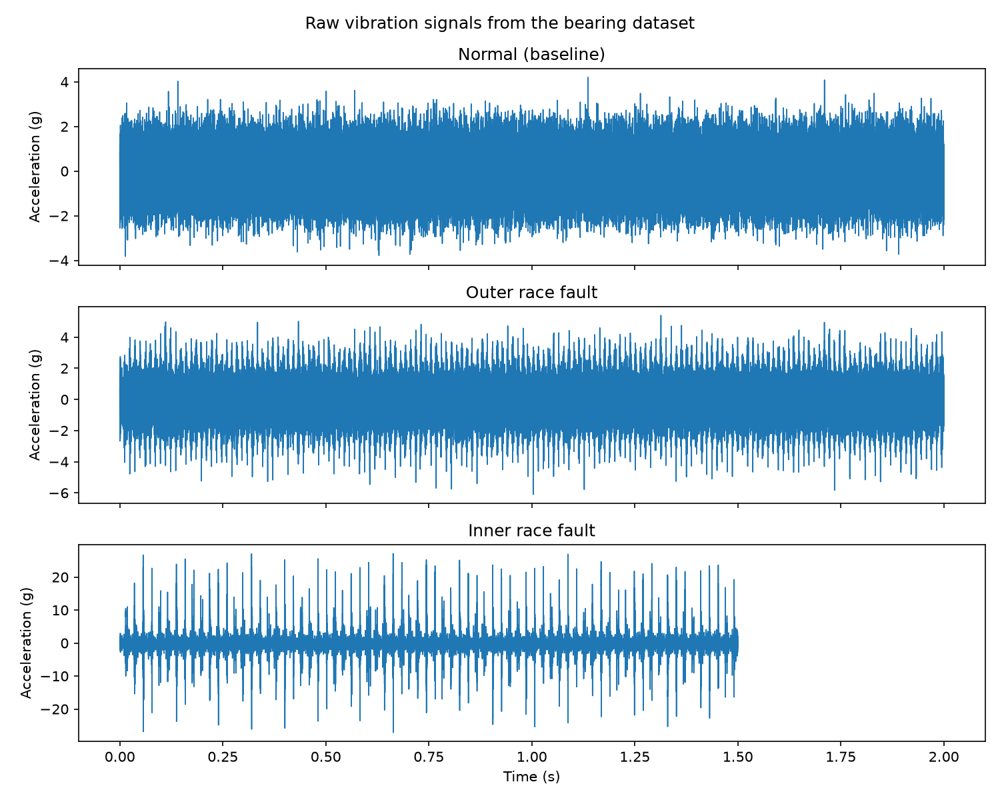
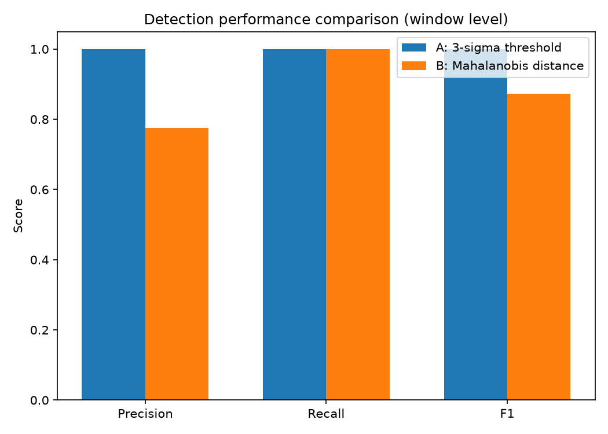

# Motor Health Monitor

面向小型工厂的低成本电机健康监测原型：**只用正常状态的数据训练，检测轴承振动异常**。

这个项目的目标不是再写一个"轴承故障分类教程"，而是回答一个更实际的问题：
*预算有限的小工厂，能不能用可解释的方法，在设备真正坏掉之前收到提醒？*



## 为什么做这个项目

小型工厂的电机大多没有昂贵的在线监测系统，通常是坏了才发现，维修依赖老师傅经验。
本项目探索一条低成本路线：

- 只用**正常状态**数据训练（现实中故障样本往往很难拿到）；
- 用可解释的特征（RMS、峭度、谱质心等）描述设备状态；
- 用两个轻量方法做异常检测，并诚实比较优缺点；
- 后续再引入维护成本与跨数据验证，让结论更接近真实决策。

## 数据集

- 来源：[MathWorks Rolling Element Bearing Fault Diagnosis 数据](https://github.com/mathworks/RollingElementBearingFaultDiagnosis-Data)
  （原始数据来自 data-acoustics.com，由 Eric Bechhoefer 提供）。
- 许可：Creative Commons Attribution-NonCommercial-ShareAlike 4.0。
- 本次使用 8 个文件：2 个正常基线文件用于训练；
  测试集包含 1 个正常文件、3 个外圈故障文件、2 个内圈故障文件。
- 采样率：97,656 Hz（6 秒）与 48,828 Hz（3 秒）两种。
- 每个文件包含振动信号 `gs`、采样率 `sr`、转速 `rate`、载荷 `load`
  与四种轴承故障特征频率（BPFO/BPFI/FTF/BSF）。

## 方法

信号按 1 秒窗口、0.5 秒步长切分（50% 重叠），每个窗口提取：
均值、标准差、RMS、峰值、峰均比、偏度、峭度、谱质心、主频。

- **方法 A（基线）：3σ 阈值法。** 只用 RMS，报警线 = 正常窗口均值 + 3 倍标准差。
- **方法 B：马氏距离法。** 综合 RMS、峰均比、峭度、谱质心四个特征，
  用正常窗口估计均值与协方差，以正常训练窗口距离的第 99 百分位为报警线。
- **故障类型诊断：包络谱分析。** 检出异常后，用希尔伯特变换取包络、
  再看包络谱中轴承特征频率（BPFO/BPFI）处是否出现远高于本底的尖峰，
  从而判断是外圈还是内圈故障（可解释、零训练）。

## 结果（窗口级）

| 指标 | 方法 A（3σ 阈值） | 方法 B（马氏距离） |
| --- | ---: | ---: |
| 准确率 | 1.000 | 0.786 |
| 精确率 | 1.000 | 0.775 |
| 召回率 | 1.000 | 1.000 |
| F1 | 1.000 | 0.873 |

混淆矩阵（实际 11 个正常窗口、31 个故障窗口）：

- 方法 A：正常 11/11 判对，故障 31/31 判对，零误报零漏报。
- 方法 B：故障 31/31 全部检出，但 11 个正常窗口中有 9 个被误报。



**结论与反思：** 在这份数据上，只用一个 RMS 特征反而最可靠；
多特征的马氏距离虽然把所有故障都检出了，却带来了更多误报。
这说明"特征更多"不等于"效果更好"——当测试数据的分布和训练数据略有差异时，
更复杂的特征空间反而更容易误报。真实系统里，误报和漏报的代价不同，
下一步应该用维护成本去选择合适的报警线，而不是只看准确率。

## 快速开始

```powershell
python -m pip install -r requirements.txt
python src/download_data.py
python src/run_pipeline.py
```

运行后会生成：

- `outputs/report.md`：完整实验报告
- `outputs/figures/`：波形图、特征空间图、方法对比图

数据文件与输出结果默认不提交到 Git（见 `.gitignore`），
`docs/figures/` 里保留了少量结果图供 README 展示。

## 项目结构

```text
motor-health-monitor/
├── README.md
├── requirements.txt
├── tests/             # 单元测试（pytest）
├── docs/
│   ├── ROADMAP.md        # 项目路线图与差异化策略
│   └── figures/          # README 展示用的结果图
└── src/
    ├── lesson/           # v0 模拟数据入门原型（学习记录）
    ├── config.py         # 路径与实验参数
    ├── data_loading.py   # 下载并读取真实数据
    ├── features.py       # 窗口特征提取
    ├── detection.py      # 两种异常检测方法
    ├── cost_analysis.py  # 成本敏感的报警线选择
    ├── evaluate.py       # 评估指标
    ├── plotting.py       # 图表
    ├── download_data.py  # 数据下载入口
    └── run_pipeline.py   # 一键运行入口
```

## 诚实说明与局限

- 数据来自公开的**单一试验台、单一传感器**，不代表真实工厂里的所有工况。
- 本实验只在"文件级已知故障"上验证，没有覆盖早期微弱故障、变转速、变载荷等情况。
- 方法 B 的误报说明特征选择与阈值设定仍需改进。
- 目前**没有真实硬件验证**，这是下一步的重点。

## 下一步（详见 docs/ROADMAP.md）

1. ~~用维护成本（漏报 vs 误报代价）来决定报警阈值~~ 已完成：`src/cost_analysis.py`
   在给定"漏报:误报代价倍率"下扫描报警线、选出总代价最低的一条（见下方"成本视角"）。
2. 跨数据集验证：在另一套试验台数据上测试，检验方法是否"只认一套数据"。
3. 条件允许后，用 ESP32 + 低成本加速度计采集自己的数据。

## 成本视角：报警线应该设多高？

F1 把误报和漏报看得同样重，但真实工厂里两者代价不同：
误报浪费一次停机检查，漏报可能让轴承坏在运行中。
`src/cost_analysis.py` 把一次漏报的代价设为一次误报的 N 倍（N 可调），
扫描报警线并选出总代价最低的一条：

- 本数据集上方法 A 在 1～50 倍的所有代价假设下最优报警线都稳定在约 2.2σ
  （正常与故障分得很开，阈值不敏感）——这本身是个有用的结论：
  **只有当数据更难、或训练/测试分布漂移时，成本分析才真正开始起作用**，
  这正是 v2 跨数据集验证要回答的问题。
- 报告与图表见 `outputs/report.md` 第 5 节与 `outputs/figures/cost_curves.png`。

## 测试

```powershell
python -m pip install -r requirements.txt
python -m pytest tests
```

16 个单元测试覆盖特征提取、两种检测器、评估指标与成本分析。

## English summary

A low-cost motor health monitoring prototype: train only on healthy bearing
vibration, then detect anomalies with two interpretable methods
(a 3-sigma RMS threshold and a Mahalanobis-distance detector).
On the public MathWorks rolling-element bearing dataset, the simple RMS
threshold achieved perfect window-level separation (F1 = 1.000), while the
multi-feature Mahalanobis detector found every fault (recall = 1.000) but
raised more false alarms (precision = 0.775). The lesson: more features are
not automatically better, and alarm thresholds should reflect real
maintenance costs.

## 数据许可与致谢

Data: Rolling Element Bearing Fault Diagnosis dataset, provided by MathWorks
(original data by Eric Bechhoefer, data-acoustics.com), licensed under
CC BY-NC-SA 4.0. This project is for learning and non-commercial use.
